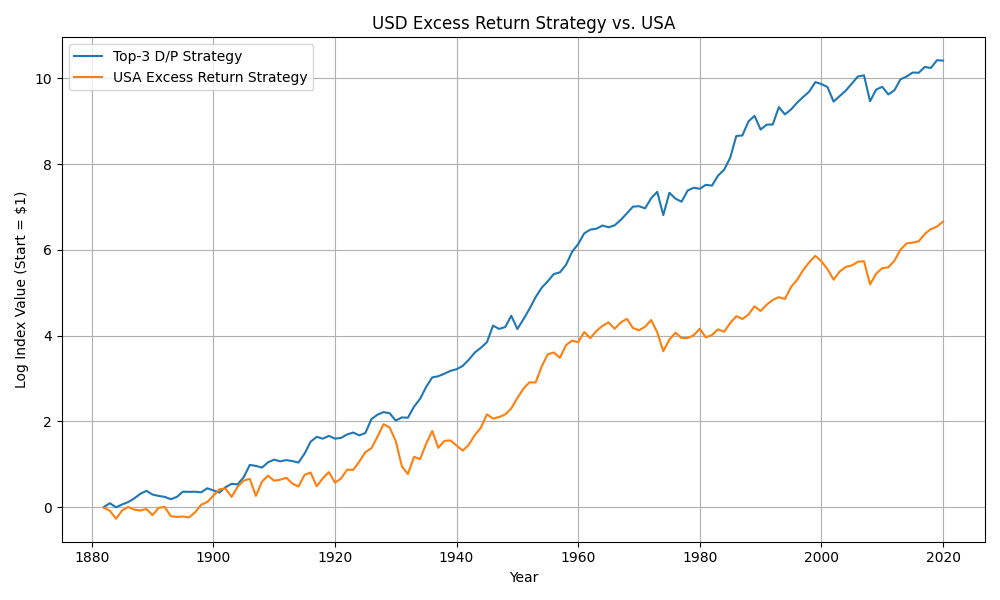
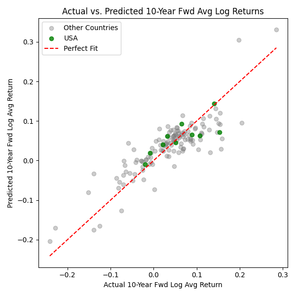

# Time Varying Equity Premium  
#### Birju Patel

This project explores the time-varying nature of the equity risk premium using international data. I use the [Jordà-Schularick-Taylor Macrohistory Database](https://www.macrohistory.net/data/), which contains more than a century of macro-financial data across 16 developed countries.

The work is inspired by **Campbell and Shiller (1998), "Stock Prices, Earnings, and Expected Dividends"**. I replicate their finding on international data. Below are the key empirical findings.

- Smoothed dividend-price (D/P) ratios have some predictive power on future long-term equity returns.
- D/P ratios have no predictive power on future long-term dividend growth.

This contradicts the hypothesis that equity market prices contain rational expectations of future dividend growth.

### Regression Summary

The table below shows the explanatory power of the smoothed lagged dividend-price (D/P) ratio for forecasting 10-year future outcomes.

| Model                                 | R²     | Sample Size |
|---------------------------------------|--------|--------------|
| Forward Real Dividend Growth          | 0.048  | 142          |
| Forward Average Real Equity Returns   | 0.196  | 142          |

The D/P ratio has modest predictive power for future equity returns, but negligible explanatory power for future dividend growth.

### Strategy Construction
I then construct a strategy to exploit this relationship.

The strategy goes long equities and short bills in the **3 countries with the highest D/P ratio**, with equal weights and annual rotation.

This is benchmarked against a strategy that goes long U.S. equities and short U.S. bills.

The strategy outperforms the benchmark in the period from 1880 to 2020.



| Metric                    | Strategy (Top-3 D/P)        | Benchmark (USA)       |
|---------------------------|-----------------------------|-----------------------|
| Mean Excess Return        | 9.12%                       | 6.57%                 |
| Std Dev (Volatility)      | 16.86%                      | 18.18%                |
| Sharpe Ratio              | 0.54                        | 0.36                  |

### Economic Investigation
I then study the key economic drivers of equity returns with a multivariable linear regression.

The goal of this regression is to explain the variance in equity returns ex-post, not to predict future returns.

#### Independent Variables:
- Log of Smoothed D/P ratio
- Growth rate of real dividends over the next 10 years
- Average inflation over the next 10 years

#### Dependent Variable:
- Average real equity return over the next 10 years

This model is incredibly strong. These three factors explain 73% of the variance in long-term real equity returns across countries and through time.



#### Dependent Variable: 10-Year Forward Log Real Equity Return

| Statistic                 | Value       |
|---------------------------|-------------|
| R²                        | 0.732       |
| F-statistic               | 125.8       |
| Observations              | 142         |

#### Estimated Coefficients

| Variable                  | Coefficient | Std. Error | t-Stat | P-value  |
|---------------------------|-------------|------------|--------|----------|
| Constant                  | 0.2121      | 0.022      | 9.52   | < 0.001  |
| Forward Real Div Growth   | 0.5669      | 0.050      | 11.31  | < 0.001  |
| Lagged Log D/P            | 0.0478      | 0.007      | 6.82   | < 0.001  |
| Forward Avg Inflation     | -0.3886     | 0.067      | -5.79  | < 0.001  |

### Scripts

Run this to install Python dependencies.

```
python -m pip install numpy pandas statsmodels matplotlib seaborn scipy
```

- `shiller_regression.py` - Regresses smoothed D/P ratio on various measures of equity returns
- `backtest.py` - Backtests D/P ratio sorting strategy and plots vs. benchmark
- `index.py` - Plots a single country's cumulative equity market return and D/P ratio over time
- `multiple_regression.py` - Creates multivariable model to explain cross country and time series variation in real equity returns
- `implied_variable_analysis.py` - Given a hardcoded D/P ratio and inflation expectations, calculates series of possible future long-run dividend growth and real equity return implied by the multivariable model